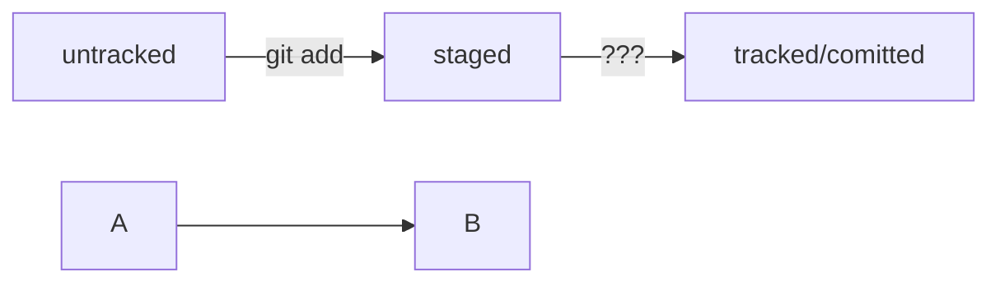

*Подсказка: как сделать mermaid-схему*

**Чтобы получить mermaid-схему в README.md, нужно добавить блок кода типа mermaid.**

HEAD -- это голова.
Коммит -- это всему голова.
Статусы файлов:
<тут пустая строка!>

```mermaid
%% описание схемы
```
<и тут пустая строка!> 

**Ниже вы найдёте заготовку для схемы статусов файлов.**


